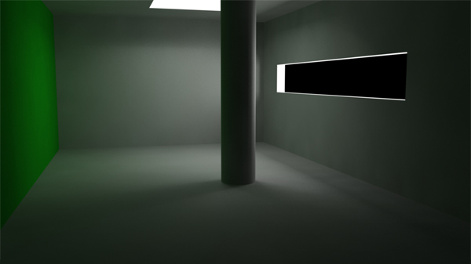
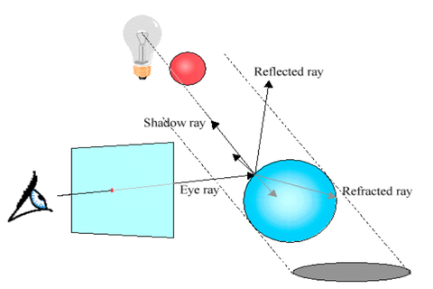
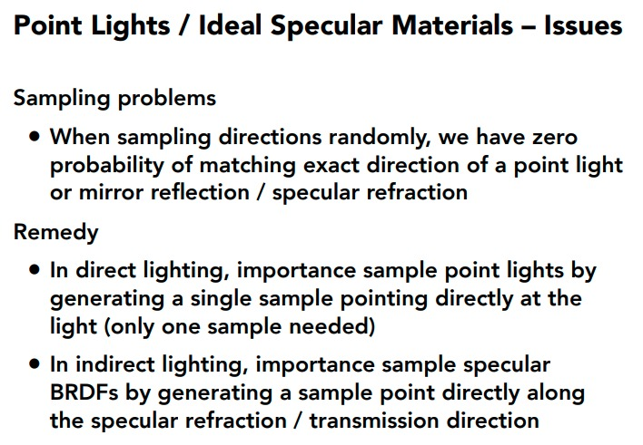
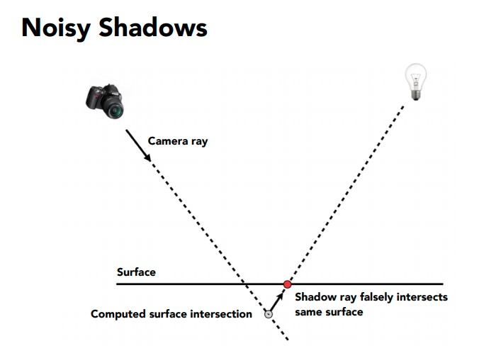
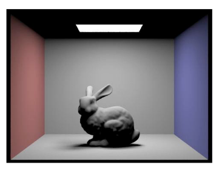
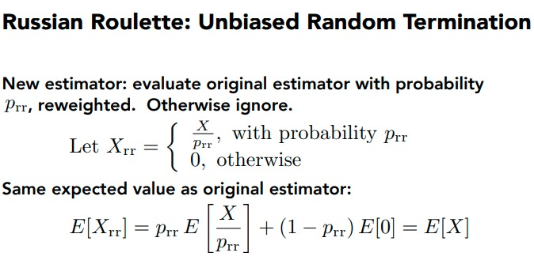
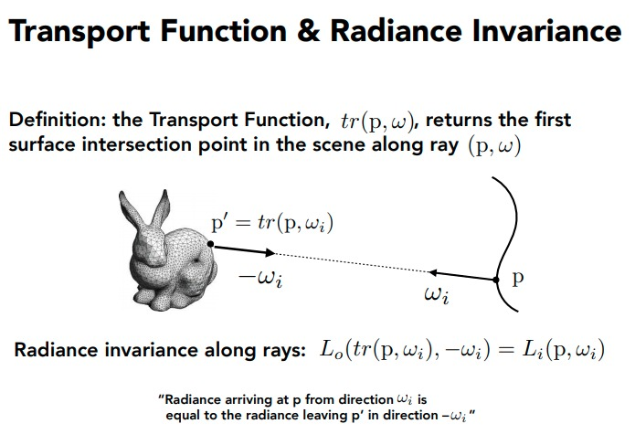
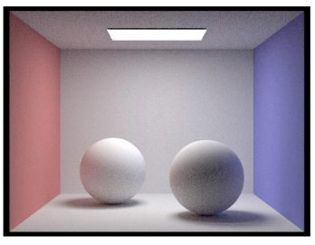

# Lab 5: Illumination

## Logistics

### Deadline
* The deadline for the entire lab is 11:55pm Monday, 26th Oct 2020.
* Late submission policies apply as stated on LMS.

### Building the assignment

In your assignment directory, execute this command:

```
mkdir build && cd build && cmake .. && make

```

We will be using some more pathtracer command parameters for this lab, so let's look into them:

|Flag and parameters|Description|
|-------------------|-----------|
|-s <INT>|	Number of camera rays per pixel (default=1, should be a power of 2)|
|-l <INT>|	Number of samples per area light (default=1)|
|-t <INT>|	Number of render threads (default=1) We recommend running with 4-8 threads almost always.|
|-m <INT>|	Maximum ray depth (default=1)|
|-f <FILENAME>| Image (.png) file to save output to in windowless mode|
|-r <INT> <INT>| Width and height of output image (if windowless)|
|-h	|Print command line help message|

Keyboard commands:
|Command|Key|
|-------|---|
|Start rendering|R|
|Save a screenshot|S|
|Decrease/increase area light samples|- +|
|Decrease/increase camera rays per pixel|[ ]|
|Decrease/increase maximum ray depth|< >|


## Project structure

- Task 1: Direct Lighting
- Task 2: Indirect Lighting

# Task1: Direct Lighting



Go to `estimate_direct_lighting` in *pathtracer.cpp*

This function is called by `trace_ray` in order to get an estimate of the direct lighting at a point after a ray hit. At a high  level, it should sum over every light source in the scene, taking samples from the surface of each light, computing the incoming radiance from those sampled directions, then converting those to outgoing radiance using the BSDF at the surface. Each material associated to a primitive has its own BSDF (bi-directional scattering distribution) function (glossy, mirror, refractive etc.) based on how that surface scatters light which can be called by `isect.bsdf->f()` if you have intersection information about it. The BSDF function when called with specific parameters mentioned later returns the reflectance of the surface of the material (its effectiveness in reflecting radiant energy) as a `Spectrum`. 

Look at both the `BSDF` and `Intersection` classes to understand this. For information about lights, look at `static_scene/light.h`. It is also necessary to understand how these functions are called during ray-tracing. Inside `trace_ray()`, scene intersection is checked using bvh->intersect(...). If there is an intersection, the accumulated Spectrum L_out is returned after
- adding the BSDF's emission with `bsdf->get_emission()` if appropriate,
- adding direct lighting with `estimate_direct_lighting(...)`, and
- adding indirect lighting with `estimate_indirect_lighting(...)`, which will recurse to call `trace_ray(...)` once more. 

The starter code at the top of the function uses the input intersection normal to calculate a local coordinate space for the object hit point. In this frame of reference, the normal to the surface is (0, 0, 1) (so z is "up" and x,y are two other arbitrary perpendicular directions). We compute this transform because the BSDF functions you will define later expect the normal to be (0, 0, 1).

Additionally, in this coordinate system the cosine of the angle between a direction vector `w_in` and the normal vector `Vector3D(0,0,1)` is simply `w_in.z`. (This is clear if you remember that the cosine of the angle between two unit vectors is equal to their dot product.) We store the transformation from local object space to world space in the matrix `o2w`. This matrix is orthonormal, thus `o2w.T()` is both its transpose and its inverse -- we store this world to object transform as `w2o`. 

    Matrix3x3 o2w; 
    
    make_coord_space(o2w, isect.n); 

    Matrix3x3 w2o=o2w.T()


## Part 1: Scenelight Loop



Go to `estimate_direct_lighting` in *pathtracer.cpp*

1) Loop over every `SceneLight` in the PathTracer's vector of light pointers `scene->lights`. 

2) For each light, check if it is a delta light. If so, you only need to ask the light for 1 sample (since all samples would be the same). Else you should ask for `ns_area_light` samples in a loop.

3) To get each sample, call the `SceneLight::sample_L()` function. This function requests the ray hit point `hit_p` and returns both the incoming radiance as a `Spectrum` as well as 3 values by pointer. The values returned by pointer are 

 - a probabilistically sampled `wi` unit vector giving the direction from `hit_p` to the light source
 - a `distToLight` float giving the distance from `hit_p` to the light source
 - a `pdf` float giving the probability density function evaluated at the returned `wi` direction

4)  The `wi` direction returned by `sample_L` is in world space. In order to pass it to the BSDF, you need to compute it in object space by calculating `Vector3D w_in = w2o * wi`. 

5) Check if the z-coordinate of w_in is negative -- if so, you can continue the loop since you know the sampled light point lies behind the surface. 

## Part 2: Shadow Ray



Go to `estimate_direct_lighting` in *pathtracer.cpp*

1) Cast a shadow ray from the intersection point towards the light, testing against the bvhto see if it intersects the scene anywhere. Two subtleties: 

 - You should set the ray's `max_t` to be the distance to the light, since we don't care about intersections behind the light source. 

 - You should offset the origin of the ray from the hit point by the tiny global constant `EPS_D`(i.e., add EPS_D * wi to hit_p to get the shadow ray's origin). If you don't do this, the ray will frequently intersect the same triangle at the same spot again because of floating point imprecision.

2) If the ray does not intersect the scene, you can calculate the BSDF value at `w_out` and `w_in`. Accumulate the result (with the correct multiplicative factors) inside `L_out`.

Factors to remember when summing up the radiance values in L_out: 

 - `sample_L` returns an incoming radiance. To properly multiply this by the BSDF, you need to convert it to irradiance using a cosine term. 

 - You are summing up some number of samples per light. Make sure you average them correctly. 

 - The `sample_L` routine samples from a light. It does this using some probability distribution which can bias the sample towards certain parts of the light -- you need to account for this fact by using the returned pdfvalue when summing radiance values

Now you should be able to render nice direct lighting effects such as area light shadows and ambient occlusion, albeit without full global illumination. However, you will only be able to render files with Lambertian diffuse BSDFs, as we have not yet implemented any of the other BSDFs. At this point, here are the results of the commands

    ./pathtracer -t 8 -s 64 -l 32 -m 6../dae/sky/CBbunny.dae
    


# Task 2: Indirect Lighting

Go to `estimate_indirect_lighting` in *pathtracer.cpp*

This function is called by `trace_ray` in order to get an estimate of the indirect lighting at a point after a ray hit. At a high level, it should take one sample from the BSDF at the hit point and recursively trace a ray in that sample direction

We provide with the same setup code as in the direct lighting function: 

    Matrix3x3 o2w; 
    
    make_coord_space(o2w, isect.n); 
    
    Matrix3x3 w2o=o2w.T(); 
    
    Vector3D hit_p=r.o+r.d*isect.t; 
  
    Vector3D w_out=w2o* (-r.d);

`w2o` transforms world space vectors into a local coordinate frame where the normal is `(0, 0, 1)`,the unit vector in the z-direction. Thus `w_out` is the outgoing radiance direction in this local frame. You need to implement the following steps: 

## Part 1: Ray termination



Go to `estimate_indirect_lighting` in *pathtracer.cpp*

1. Take a sample from the surface BSDF at the intersection point using `isect.bsdf->sample_f()`. This function requests the outgoing radiance direction `w_out` and returns the BSDF value as a `Spectrum` as well as 2 values by pointer. The values returned by pointer are the probabilistically sampled `w_in` unit vector giving the incoming radiance direction (note that unlike the direction returned by `sample_L`, this `w_in` vector is in the `object` coordinate frame!) anda `pdf` float giving the probability density function evaluated at the return `w_in` direction.

2. Use Russian roulette to decide whether to randomly terminate the ray. We recommend basing this on the reflectance of the BSDF `Spectrum`, calculated with the spectrum's `illum()` method -- the lower the reflectance, the more likely you should be to terminate the ray and return an empty `Spectrum`. You can use the `coin_flip` method from random_util.h to generate randomness. Remember that you need to divide by one minus the Russian roulette probability (i.e., the probability of not terminating) when you return a radiance value. 

Note: you may want to multiply `illum()` by some large constant (>10) and then add it by someconstant (e.g. 0.05) to make sure that rays are not terminated too early, resulting in high noise.

## Part 2: Radiance estimation



Go to `estimate_indirect_lighting` in *pathtracer.cpp*

1) If not terminating, create a ray that starts from `EPS_D` away from the hit point and travels in the direction of `o2w * w_in` (the incoming radiance direction converted to world coordinates). This ray should have depth `r.depth - 1`. (Note that for the ray depth cutoff to work, you should initialize your camera rays to have depth `max_ray_depth`.)

2)  Use `trace_ray` to recursively trace this ray, getting an approximation for its incoming radiance. The `includeLe` parameter should be set to `isect.bsdf->is_delta()` since emission was not included in the direct lighting calculation for delta BSDFs.

3) Convert this incoming radiance into an outgoing radiance estimator by scaling by the BSDF and a cosine factor and dividing by the BSDF `pdf` and 1 minus the Russian roulette termination probability. 

 You should now see some nice color bleeding in Lambertian scenes. You should be able to correctly render images such as:
 
    ./pathtracer -t 8 -s 64 -l 16 -m 5  ../dae/sky/CBspheres_lambertian.dae


