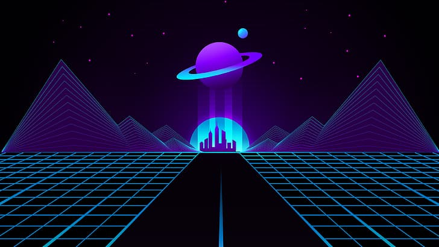
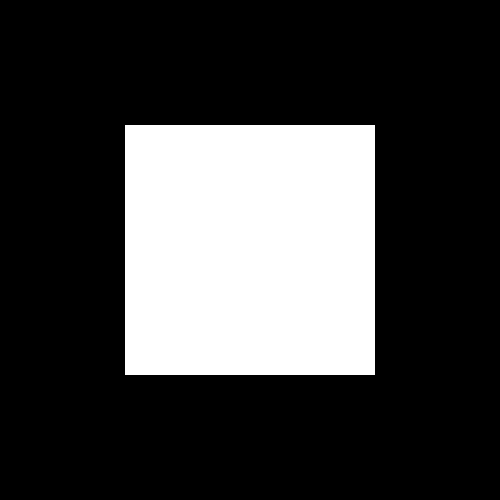
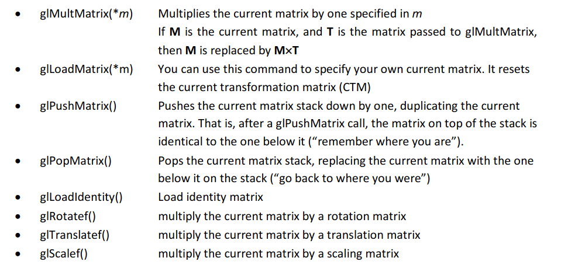
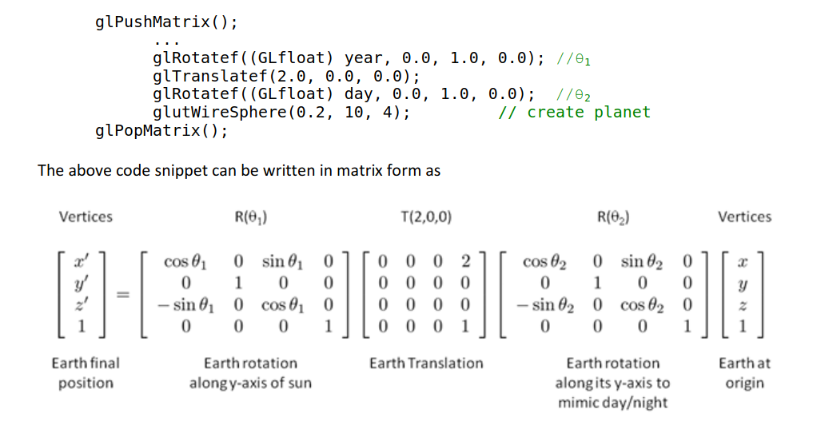
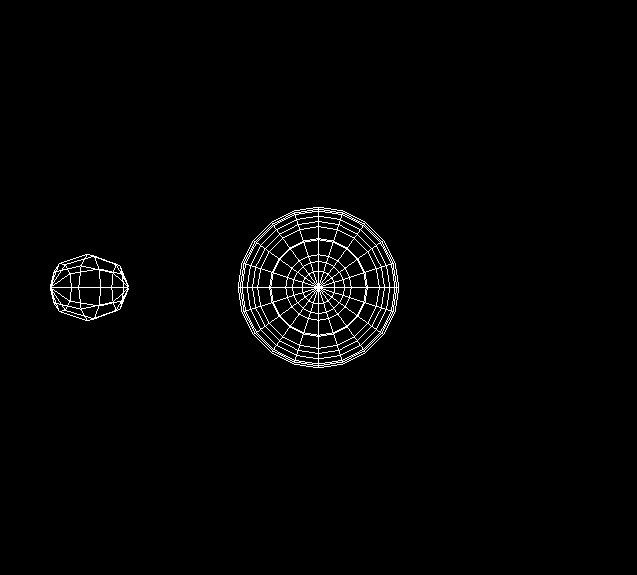
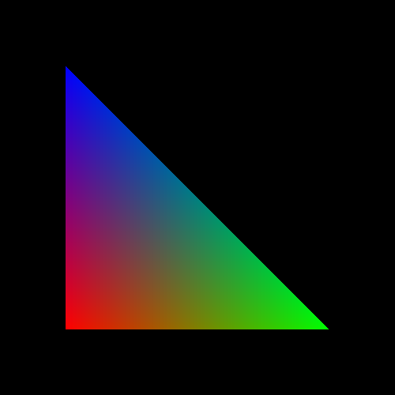
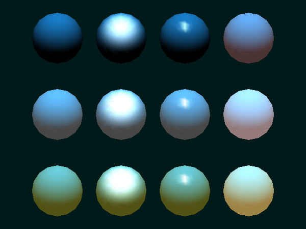
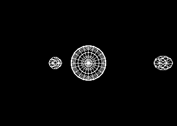

# Lab6: Intro to OpenGL

## What is OpenGL?

OpenGL  is  a  library  of  functions  that  access  the  graphics  capabilities  of  computers.  It  prevents  the  developer from having to write the code for standard functions that are common to many applications and shield the application from details of the hardware. Thus programs can be developed more quickly and become more portable.
OpenGL is a software interface to graphics hardware. It is designed as a hardware-independent interface to  be  used  for  many  different  hardware  platforms.  A  typical  OpenGL  program  should  run  on  any  implementation  after  recompilation  with  the  OpenGL  libraries  for  that  system.  The  key  features  of  OpenGL are as follows:

    • “a software interface to graphics hardware”

    • 3D graphics and modeling library (API)

    • About 200 distinct commands

    • hardware independent, portable

    • very fast

### The programmers View

Generally, most graphics application programs consist of three major elements:

    •Specify geometric objects

    •Describe properties of these objects

    •Define how these objects should be viewed

If  the  program  is  interactive  it  will  also  have  some  input  functions.  Finally,  all  programs  will  have  some  initialization,  it  will  also  have  some  input  functions  that  interact  with  the  local  operation  system  and  window environment.

The  programmer’s  view  gives  us  a  way  of  categorizing  the  OpenGL  functions.  But  it  does  not  tell  us  anything about how OpenGL works.

### The OpenGL State Machine

A state machine is a term for describing, in simplest terms, is a machine that stays in a persistent state until it receives a message that tells it to change. This is a very common and basic model of computing. OpenGL is a finite state machine, as it has a predetermined and countable number of different states. If  we  take a slightly  different  perspective, we can think  of  OpenGL  as  a  state  machine  with  inputs  and  outputs. The  inputs  are  description  of  geometric  objects, such as line  segments  and  polygons, and  discrete  objects,  such  as  bitmaps,  that  are  specified  through  OpenGL  function  calls.  The  output is  an image that we see on our display. Between the inputs and the output is a machine that takes the objects and converts them into an image. How the machine processes its input depends upon its state. The state  of  the  OpenGL  machine  is  set  by  OpenGL  functions  that  specify  colors,  viewing  conditions,  texture  parameters,  and  many  other  variables.  The  state  determines  how  the  inputs  are  processed.  From the perspective, the OpenGL functions either change the state of the OpenGL machine or send the inputs to the machine.

Various  states  are  set  and  remain  in  effect  till  changed.  Many  states  are  enabled  and  disabled  such  as  **glEnable()** and **glDisable()** e.g. glEnable(GL_LIGHTING). State variables can be queried: e.g. glGetFloatv(), glIsEnabled(), glGetLight*(), glGetError() and other large set of glGet*() commands.

### The OpenGL pipeline

From the implementation perspective, we can view OpenGL programs behaviors in a different manner. OpenGL  is  based  on  what  is  called  a  pipeline  model.  A  simple  pipeline  is  shown  in  Figure 1.  Primitives are  generated  in  the  application  program  and  flow  through  the  pipeline.  Within  the  pipeline,  each  sequence  of  modules  performs  some  functions  on  the  primitives.  Some  modules  do  transformations  that  rotate,  translate,  and  scale  the  object (Transformer).  Another  module  is  responsible  for  positioning  the  objects  relative to OpenGL’s camera (Projector). Another module determines whether an object is visible (Clipper). At the end of the pipeline,  those  primitives  that  are  visible  are  converted  into  colored  picture  elements  or  pixels  on  the  display (Rasterizer).

## What OpenGL is not

    •It is not a programming language it is rather a library of commands/functions

    •Has no windowing commands

    •Has no user-interface commands

    •It does not have high level drawing functions like curves, functions to draw a car directly

    •Competitor: Direct3D API of Microsoft

## What is GLUT?

The  OpenGL  Utility  Toolkit  (GLUT)  is  a  library  of  functions  that  are  common  to  virtually  all  modern  windowing systems. GLUT has been implemented on all the popular systems, so programs written using the  GLUT  API  for  windowing  and  input  can  be  compiled  with  the  source  code  unchanged  on  all  these  systems. We use GLUT throughout this handout.

GLUT  is  not  a  part  of  OpenGL  standard  API,  yet its very  popular  as  it  takes  care  of  windows-system-specific functions, user interface. All glut functions have prefix **glut**. It contains several high level drawing functions such as:

    glutWireCube, glutSolidCube, glutSolidIcosahedron, glutWireTorus 
 
 All GLUT functions have prefix glut e.g. glutCreateWindow(). The library can be included using:

    # include "GL/glut.h" 

## OpenGL Programming Conventions

The OpenGL functions are contained into two libraries namely gl and glu. GL is the core library that contains all the required functions such as *glVertex3f(), glClearColor(), glBegin()*. All GL functions have prefix **gl** and can be included using:

    #include "gl.h"

GLU is part of every OpenGL implementation and contains about 50 commands on top of OpenGL core library.  It  contains  higher  level  commands,  e.g.  *gluCylinder(),  gluPerspective()* etc. All GLU functions have prefix **glu** and can be included using:

    #include "glu.h"
    
Many OpenGL functions have *arguments whose values are chosen from a small, discrete set of integers for which macros are defined*. The prefixes GL_ and GLU_ defines the include file from which the macro comes, such as GL_LINES, GL_POLYGON, GL_LIGHT0

The `#include "glut.h"` statement ensures that both gl.h and glu.h are included

## Getting Started

In this section we will discuss how to create a simple program with OpenGL and GLUT and will also dissect the various sections of the code to understand OpenGL programming structure.

### Setup:

Run the following commands on your terminal:

    sudo apt-get update
    
    sudo apt-get install libglu1-mesa-dev freeglut3-dev mesa-common-dev

If you're on a mac, add the following code on top of your `cpp` files:

    #ifdef __APPLE__
    #  include <GLUT/glut.h>
    #else
    #  include "GL/glut.h"
    #endif

### A simple program

Go to `simple.cpp` in your master directory. Try to follow the code and make sense of what it's trying to do.

To see the code in action, run the following command (g++ compilation of a c++ program along with glut, GLU and GL previously described):
    
    g++ simple.cpp -lglut -lGLU -lGL && ./a.out

For MacOS, please use:

    g++ simple.cpp -framework OpenGL -framework GLUT -framework Cocoa && ./a.out
    

### Structure of OpenGL Program

OpenGL’s structure is *event-driven*. At each event of interest (like mouse-click) a callback function is defined, *glutMainLoop()* is handling all events for us.

There are 5 routines to initialize a window: 

    i. glutInit(int *argc, **argv) initializes GLUT

    ii.glutInitDisplayMode(unsigned int mode) selects RGBA/Indexed Color Mode, and Single/Double Buffering

    iii.glutInitWindowPosition(int x, int y) 

    iv.glutInitWindowSize(int width, int height)
    
    v.glutCreateWindow(char* title) actually creates the window with string title given by the argument
    
 After this, **glutMainLoop()** is called and the window is displayed.
 
 ### Event Loops and Callback functions
 
Most  interactive  programs  are  based  on  the  program’s  reacting  to  variety  of  discrete  events  such  as  mouse, keyboard, window etc. Events are processed sequentially from the event queue. The application programmer  writes  a  set  of  Callback  functions  that  define  how  the  program  should  react  to  specific  events. In GLUT most common events are recognized such as:
    
    • glutDisplayFunc 
    
    • glutReshapeFunc 
    
    • glutKeyboardFunc 
    
    • glutMouseFunc 
    
    • glutMotionFunc 
    
    • glutIdleFunc
    
The  application  program  can  define  its  own  callback  functions.  A callback  is  called  when  no  other events are pending. In our sample application only a single callback, the display callback, which is invoked whenever OpenGL determines that the display has to be redrawn. 

    glutDisplayFunc(display);
    
The function display is called each time there is a **display** callback. Display callback is generated such  as  when  window  opens.  The  **reshape**  callback  (glutReshapeFunc())  is  invoked  whenever  the window is moved, resized or exposed. Similarly, **keyboard, mouse** and **motion** callback are generated when there are mouse or keyboard operations.

### Drawing a Rectangle

Now  we  have  to  define  our  display  callback,  which  we  have  chosen  to  name  display.  This  display  function  specifies  how  to  create  geometric  object  using the **glVertex*()** function.  The  fundamental  entity for specifying objects is the vertex, a location in space. Simple geometric objects such as lines and polygons,  can  be  specified  through  a  collection of vertices. OpenGL allows us to work in *two, three, or four* dimensions through variants of the function glVertex*() as shown in Table 1. 

As  vertices  can  define  a  variety  of  objects,  we  must  tell  OpenGL  what  object  a  list  of  vertices  defines  and  where  the  beginning  and  the  end  of  the  list  occur.  We  make  this  specification  through  the  functions:

    glBegin(GLenum mode); 
    
    ... 
    
    glEnd();
    
The **GLenum mode** parameter includes:

GL_POINTS   GL_LINES

GL_LINE_STRIP   GL_LINE_LOOP

GL_TRIANGLES    GL_TRIANGLE_STRIP

GL_TRIANGLE_FAN GL_QUADS

GL_QUAD_STRIP   GL_POLYGO

**glClear()** clears  the  window  i.e.  it  replaces  every  pixel  value  with  the  color  passed  to  it  as  an  argument. Finally, **glFlush()**  ensures  that  the  drawing  commands  are  actually  executed,  rather  than  stored  in  a  buffer awaiting additional OpenGL commands, flushing them out of the buffer to the current display window.

As  shown  in  Figure 1  in  most  of  the  OpenGL  programs  we  also  have  to  specify  the  *modeling  transformation* that  will  be  applied  on  various  primitives  in  order  to  create  a  3D  scene.  Moreover,  we also have to specify *viewing transformation or projection* that defines how the image gets mapped into the screen. *Discussion on viewing transformations or projections is beyond the scope of this tutorial and will be treated as a black box for now. Here we will concentrate more on the modeling transformations.*

## Hierarchical Modeling

Graphics systems maintain a **current transformation matrix (CTM) as a 4x4 homogenous coordinate matrix** as  part  of  its  state. The  CTM  is  applied  to  all  the  vertices  passing  down  the  pipeline.  Recall  that  Matrix multiplication is *associative i.e. we can combine sequence of transforms into a single transform.*

    v’   = RTSR(v)

Where  R,  T  and  S  are  rotation,  translation  and  scaling  transforms  (4x4  homogenous  coordinate  matrix)  applied to vertex v to obtain transformed vertex v’. We can perform the same operation as follows

    M = RTSR
    
    v’ = Mv
    
The *matrix M can be considered as the current transformation matrix* in OpenGL state machine.

To apply various transformations OpenGL provides following convenience functions:

Transformation  commands  are  *concatenated  onto  the  CTM  (glMultMatrix)*.  The  last  one  added  is  applied first. The transformation RTSR(v) can applied in OpenGL using the following operations:

    glPushMatrix();

        glRotatef(...); 

        glTranslatef(...); 

        glScalef(...) 

        glRotatef(...); 

        glVertexf(...); 

    glPopMatrix();
    
### Excercise: A Lonely Planet - Sun and an Earth example

We want to write a program in which there is a *static sun* and *a planet earth revolving both around its center and also around the sun*. The *revolution of earth around its center creates day and night* whereas earth also completes revolution around the sun in *1 year*. Also note that the earth is always at a *certain distance from the sun*.

The above description indicates that sun is static and is not influenced by any transformation. The earth instead is performing 3 transformations: 

    •a rotation along its vertical axis
    
    •a translation from the sun along horizontal axis 
    
    •a rotation around the sun along vertical axis
    
Sun and earth can be modeled as primitive objects such as spheres having center at origin (0, 0, 0). The following code will generate the desired transformations.

Go to `planet.cpp` and try to understand the code. See if you can make sense of each and every line of code.

To run the code:

    g++ planet.cpp -lglut -lGLU -lGL; ./a.out

The timer callback is generated after every 50 milliseconds. *The timer callback updates the day of the year and the current year then to update the display i.e. the position and orientation of the earth it generates a display callback through glutPostRedisplay() function*.

## Lighting and Shading

To describe light in an OpenGL application you need to perform the following two steps: set the lighting and the shading models. But first, you have to *enable the lighting system on the whole*:

    glEnable(GL_LIGHTING);
    
 The  shading  model  is  set  up  with  a  call  to  ***glShadeModel**  and  can  be  either  set  to  *SMOOTH*  or  *FLAT*  model. 
 
The visual behavior of the lighting model is specified by the function **glLightModel**. There are *two types* of  this  function.  One  that  uses  *scalar*  values  as  parameters  and  one  for  use  with  *vector*  valued  as  parameters. Here are the definitions of both functions:

    glLightModelf(GLenum pname, GLfloat param);          // scalar params 
    
    glLightModelfv(GLenum pname, const GLfloat *params); // vector params
    
 Go to `smooth.cpp` and see if the code makes sense to you. You can see the output via the following command:
 
     g++ smooth.cpp -lglut -lGLU -lGL; ./a.out
 
 
 
### The Global Ambient Light Model
 
In addition to specifying the ambient light amount to a light source or a material, it is possible to set the *GLOBAL amount of the ambient light* which will be cast on all rendered objects. This method of lighting is called the *Global Ambient Light* and in itself is considered a lighting model.
 
So,  as  an  example  of  specifying  a  lighting  model  and  for  the  sake  of  enabling  the  global  ambient  light  model for the whole scene, a call to the **glLightModelfv** function is made. The specified parameters are **GLOBAL_AMBIENT_LIGHT_MODEL**,  which  tells  OpenGL  that  we  want  a  global  ambient  light  model  set;  and **global_ambient**, which is the *color of the global ambient light* being set:
 
    Glfloat global_ambient[] = { 0.5f, 0.5f, 0.5f, 1.0f }; 
    
    glLightModelfv(GL_LIGHT_MODEL_AMBIENT, global_ambient);
    
This is normally done during the initialization part of your OpenGL application. It's important to note that the default global ambient light intensity is R=0.2, G=0.2, B=0.2, Alpha=1.0.
 
### Defining a Light Source
 
OpenGL allows a *maximum of 8 light sources* in a scene at once. Each of the light sources can be either *enabled or disabled*.  All  of  the  8  light  sources  are  initially  disabled,  and  are  *enabled  with  a  call  to  glEnable*.
 
For each of the 8 light sources OpenGL has a name in the following format: **GL_LIGHTn**, where *n is the index number of the light source* you are specifying.  n can be a value ranging from *0 to 7*, so it  should  be  obvious  that  to  specify  a  light  source  number  1  you  would  use  GL_LIGHT0.
 
To define a light source, OpenGL presents the programmer with a basic set of functions, specification of which  divides  itself  into  these  already  familiar  to  us  light  groups:  *Ambient  Light,  Diffuse  Light,  Specular  Light*  and  *Emissive  Light*.  For  each  of  these  types  of  light  OpenGL  #defines  four  models:  **GL_AMBIENT,  GL_DIFFUSE, GL_SPECULAR** and **GL_EMISSIVE** respectively.

So how to set a specific light type and enable it in your 3D scene? For each one of the light sources you need  to  call  the  **glLightfv**  function  with  parameters  which  specify  the  *what*,  and  more  importantly  the *how*. You've actually seen this in action already; as amusingly described above. To add a component of specular light to a light source, you would make the following function call:

    GLfloat specular[] = {1.0f, 1.0f, 1.0f , 1.0f}; 

    glLightfv(GL_LIGHT0, GL_SPECULAR, specular);
    
The  *whats* here  are  the  GL_LIGHT0  light  source  and  the  specular  shading  model  described  by  the  GL_SPECULAR parameter and the *how* is the GLfloat specular parameter which defines properties of  the  specular  reflection  you  are  setting  up  for  the  GL_LIGHT0  light  source.  specular[]  is  a  4-parameter array. The parameters are described as:

    specular[] = { floatRed, floatGreen, floatBlue, floatAlpha};
    
The  first  three  parameters  are  the  RGB  values  which  can  range  from  anywhere  between  0.0f  and  1.0f.  0.0f  being  no  color,  and  1.0f  being  full  color.  0.5f  would  identify  an  average  between  the  very  bright  color and the very dim color.

But  assigning  ambient,  diffuse  and  specular  types  of  light  to  a  light  source  is  not  usually  enough.  You  also  have  to  specify  the  **position** of  the  light  source.  And  this  is,  similarly  to  defining  light  components,  done with the (glLightfv)[https://docs.microsoft.com/en-us/windows/win32/opengl/gllightfv] function in the following way:

    Glfloat position[] = { -1.5f, 1.0f, -4.0f, 1.0f }; 

    glLightfv(GL_LIGHT0, GL_POSITION, position); 

### Enabling (and Disabling) a Light Source

And  finally,  if  you  want  to  use  the  newly  created  light  source,  you  have  to  enable  it  with  a  call  to  glEnable using the light's identifier:

    glEnable(GL_LIGHT0);

All of the provided 8 OpenGL light sources are disabled by default. And just for convenience, if you want to turn off an enabled light source, you would use the glDisable function:

    glDisable(GL_LIGHT0); 
    
 ### Example program
 
 Go to `Mat.cpp` and see how it performs the following functions:
 
     •Draw twelve spheres in 3 rows with 4 columns.  
 
    •The spheres in the first row have materials with no ambient reflection.
 
    •The second row has materials with significant ambient reflection.
 
    •The third row has materials with colored ambient reflection.
 
     •The first column has materials with blue, diffuse reflection only.
 
    •The second column has blue diffuse reflection, as well as specular reflection with a low shininess exponent.
 
    •The third column has blue diffuse reflection, as well as specular reflection with a high shininess exponent (a more concentrated highlight).
 
    •The fourth column has materials which also include an emissive component.
 
 glTranslatef() is used to move spheres to their appropriate locations.
 
 
 
 
 ## Task: Not so Lonely Planet - Earth and Mars
 
 Create a new `.cpp` file named `solar_system.cpp`. Now construct the solar system with the sun and 2 planets, Mars and Earth.
 Make sure you demonstrate the differences: size,time to revolve around the sun and time to rotate around their own axis. These parameters should **not** be upto scale but rather convenient to see.  

 ## References
 
[1].http://www.songho.ca/opengl/gl_overview.html

[2].OpenGL A Primer

[3].OpenGL Programming Guide, The Red Book, http://www.opengl.org/documentation/red_book/

[4].http://www.falloutsoftware.com/tutorials/gl/gl8.htm#opengl_lighting_and_shading_models

[5].http://www.3dcodingtutorial.com/Working-with-3D-models/Importing-the-model-in-C++.html

[6].http://graphics.im.ntu.edu.tw/~robin/courses/gm05/model

